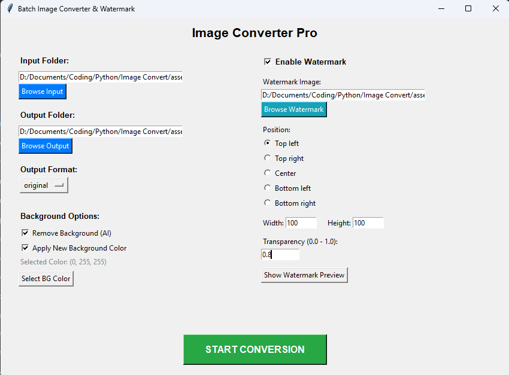
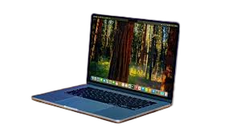
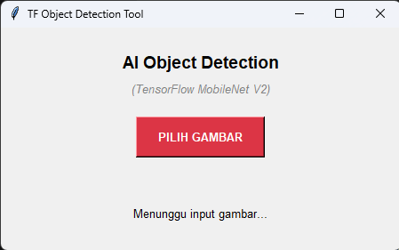
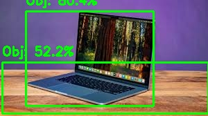
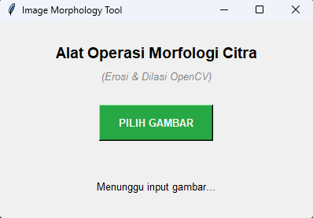
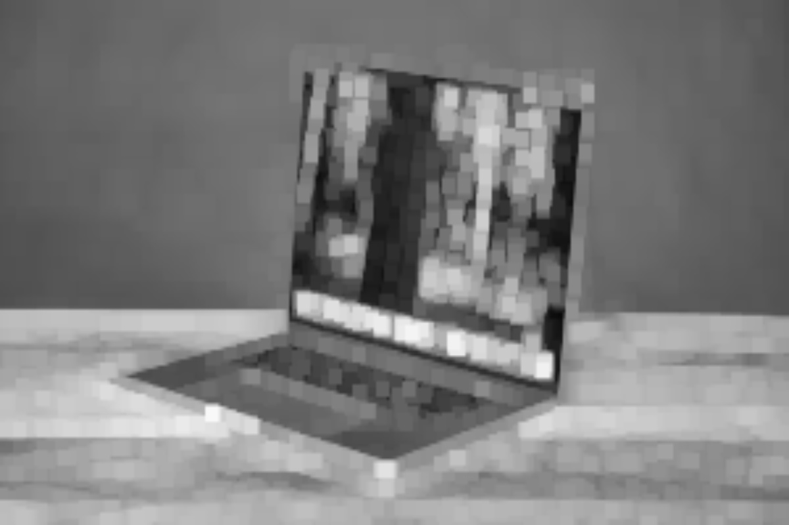
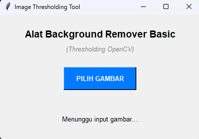
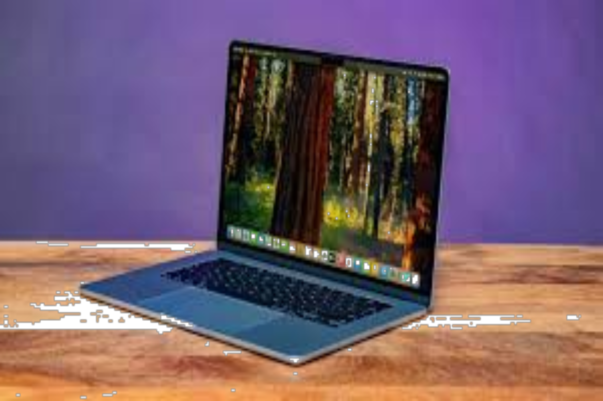

# 🧠 Vision Intelligence & Image Processing Suite

<p align="left">
  
  
  
  
</p>

## 📝 Project Overview
This repository is an **R&D Showcase** of various Computer Vision and Image Processing algorithms. It demonstrates the practical implementation of deep learning models and matrix manipulations to solve real-world visual data problems. 

The suite consists of four standalone desktop applications with intuitive Graphical User Interfaces (GUI), built to handle everything from AI-powered background removal to structural morphology and object detection.

---

## 🚀 The Toolkits & Features

### 1. Batch Image Converter Pro (AI Background Remover)
A powerful batch processing tool utilizing `rembg` for AI-driven background segmentation. It allows users to manipulate images in bulk with custom outputs.
* **Features:** Format conversion (WebP, PNG, JPEG), AI Background Removal, custom background color application, and dynamic watermarking with transparency controls.

<table border="0">
  <tr>
    <td width="50%" align="center"><b>User Interface</b></td>
    <td width="50%" align="center"><b>AI Processing Result</b></td>
  </tr>
  <tr>
    <td align="center"></td>
    <td align="center"></td>
  </tr>
</table>

### 2. AI Object Detection
An intelligent scanner that leverages the **TensorFlow MobileNet V2 (COCO)** pre-trained model to identify multiple objects within a single frame.
* **Features:** Bounding box generation, accuracy score labeling, and automatic result saving.

<table border="0">
  <tr>
    <td width="50%" align="center"><b>Detection Setup</b></td>
    <td width="50%" align="center"><b>TensorFlow Detection Output</b></td>
  </tr>
  <tr>
    <td align="center"></td>
    <td align="center"></td>
  </tr>
</table>

### 3. Image Morphology Tool
A matrix-manipulation tool to process image structures using **OpenCV Erosion and Dilation**.
* **Features:** 5x5 kernel processing to expand or shrink foreground pixels, useful for noise removal or structural enhancement.

<table border="0">
  <tr>
    <td width="33%" align="center"><b>User Interface</b></td>
    <td width="33%" align="center"><b>Dilated Image</b></td>
    <td width="33%" align="center"><b>Eroded Image</b></td>
  </tr>
  <tr>
    <td align="center"></td>
    <td align="center"></td>
    <td align="center"></td>
  </tr>
</table>

### 4. Background Remover Basic (Thresholding)
A fundamental computer vision tool that uses binary thresholding algorithms to separate objects from high-contrast backgrounds.
* **Features:** Generates both normal and inverse transparency masks, saving outputs strictly in `.png` to preserve the alpha channel.

<table border="0">
  <tr>
    <td width="50%" align="center"><b>User Interface</b></td>
    <td width="50%" align="center"><b>Thresholding Output (Inverse Mask)</b></td>
  </tr>
  <tr>
    <td align="center"></td>
    <td align="center"></td>
  </tr>
</table>

---

## ⚙️ Installation & Setup

### Prerequisites
* Python 3.10+
* Ensure you are in a virtual environment (`.venv`) to prevent library conflicts.

### 1. Install Dependencies
All required libraries, including `tensorflow`, `opencv-python`, `rembg`, and `Pillow`, are listed in the requirements file.
```bash
pip install -r requirements.txt
